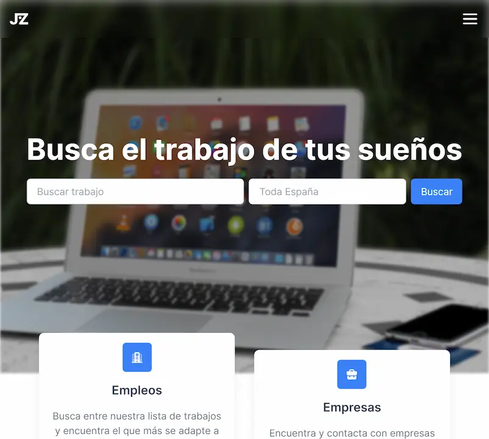

<div id="top"></div>


<div align="center">
	<a href="https://demo.vercel.app">
		
	</a>

<br/>
<br />

  # 💼 Jobzilla

  An job search app.

  <a href="https://demo.vercel.app">View Demo</a>
  ·
  <a href="https://github.com/cosmoart/jobzilla/issues">Report Bug</a>
  ·
  <a href="https://github.com/cosmoart/jobzilla/issues">Request Feature</a>

</div>


<!-- TABLE OF CONTENTS -->
<details>
<summary>Table of contents</summary>

- [About The Project](#about-the-project)
- [Screenshots](#screenshots)
- [Built With](#built-with)
- [Getting Started](#getting-started)
- [License](#license)
- [Contact](#contact)

</details>


<!-- ABOUT THE PROJECT -->
## About The Project

There are many great README templates available on GitHub; however, I didn't find one that really suited my needs so I created this enhanced one. I want to create a README template so amazing that it'll be the last one you ever need -- I think this is it.

<p align="right"><a href="#top">⬆ Back to top</a></p>


<!-- SCREENSHOTS -->
## Screenshots

<table>
    <tr>
      <td>
          
      </td>
      <td>
          
      </td>
      <td>
          
      </td>
    </tr>
</table>

<p align="right"><a href="#top">⬆ Back to top</a></p>


### Built With

* [Next.js](https://nextjs.org/)
* [React.js](https://reactjs.org/)
* [Vercel](https://vercel.com/) For hosting
* [Tailwind CSS](https://tailwindcss.com/) For styling
* [Figma](https://www.figma.com/) For the design

<p align="right"><a href="#top">⬆ Back to top</a></p>


<!-- GETTING STARTED -->
## Getting Started

1. Clone or fork the repo
```sh
git clone https://github.com/cosmoart/jobzilla
```
2. Changue to source directory
```sh
cd source
```
2. Add your own API key in env.local like
```sh
INFOJOBS_TOKEN=XXXXXXXXXXXXXXXXXX
```
3. Install NPM packages
```sh
npm install
```
4. Run the project
```sh
npm run dev
```

<p align="right"><a href="#top">⬆ Back to top</a></p>


<!-- LICENSE -->
## License

Distributed under the **MIT License**. See [`LICENSE`](https://github.com/cosmoart/jobzilla/blob/main/LICENCE) for more information.

<p align="right"><a href="#top">⬆ Back to top</a></p>

<!-- CONTACT -->
## Contact
* My website - [https://cosmoart.vercel.app](https://cosmoart.vercel.app)
* Twitter - [@CosmoArt0](https://twitter.com/cosmoart0)

<p align="right"><a href="#top">⬆ Back to top</a></p>
