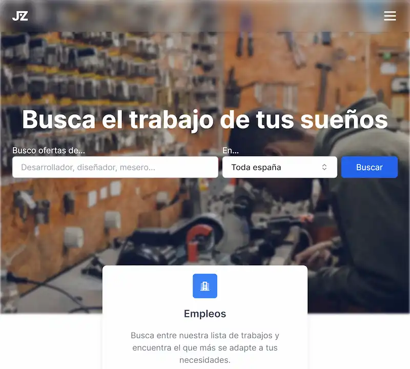
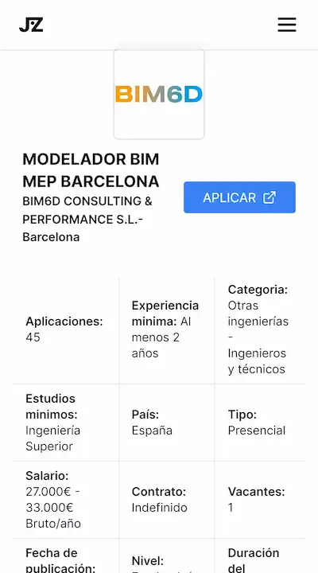

<div id="top"></div>

<div align="center">
	<a href="https://jobzilla.vercel.app">
		
	</a>

<br/>
<br />

  # 💼 Jobzilla 👨‍💻

  An app to find your next job. Built with Next.js and Tailwind CSS with the help of the **Infojobs API** and leaflet.js for the map.

  <a href="https://jobzilla.vercel.app">View Demo</a>
  ·
  <a href="https://github.com/cosmoart/jobzilla/issues">Report Bug</a>
  ·
  <a href="https://github.com/cosmoart/jobzilla/issues">Request Feature</a>

</div>


<!-- TABLE OF CONTENTS -->
<details>
<summary>Table of contents</summary>

- [About The Project](#about-the-project)
- [Screenshots](#screenshots)
- [Built With](#built-with)
- [Getting Started](#getting-started)
- [License](#license)
- [Contact](#contact)

</details>


<!-- ABOUT THE PROJECT -->
## About The Project

This is a project for the Infojobs Hackathon 2023. The app is built with Next.js and Tailwind CSS with the help of the Infojobs API and leaflet.js for the map.

<p align="right"><a href="#top">⬆ Back to top</a></p>


<!-- SCREENSHOTS -->
## Screenshots

<table>
    <tr>
      <td>
          
      </td>
      <td>
          
      </td>
      <td>
          
      </td>
    </tr>
    <tr>
      <td>
          
      </td>
      <td>
          
      </td>
      <td>
          
      </td>
    </tr>
    <tr>
      <td>
          
      </td>
      <td>
          
      </td>
      <td>
          
      </td>
    </tr>
    <tr>
      <td>
          
      </td>
      <td>
          
      </td>
      <td>
          
      </td>
    </tr>
    <tr>
      <td>
          
      </td>
      <td>
          
      </td>
      <td>
          
      </td>
    </tr>
</table>

<p align="right"><a href="#top">⬆ Back to top</a></p>


### Built With

* [Next.js](https://nextjs.org/)
* [React.js](https://reactjs.org/)
* [Vercel](https://vercel.com/) For hosting
* [Tailwind CSS](https://tailwindcss.com/) For styling
* [Figma](https://www.figma.com/) For the design
* [Pexels](https://www.pexels.com) For the images
* [React Leaflet](https://react-leaflet.js.org) For the maps
* [MapTiler](https://docs.maptiler.com/cloud/api) For geolocation
* [Medium Zoom](https://medium-zoom.francoischalifour.com) - To zoom in images
* [shadcn/ui](https://ui.shadcn.com) - For components

<p align="right"><a href="#top">⬆ Back to top</a></p>


<!-- GETTING STARTED -->
## Getting Started

1. Clone or fork the repo
```sh
git clone https://github.com/cosmoart/jobzilla
```
2. Changue to source directory
```sh
cd source
```
3. Add your own API key in env.local like
```sh
INFOJOBS_TOKEN=XXXXXXXXXXXXXXXXXX
```
4. Install NPM packages
```sh
npm install
```
5. Run the project
```sh
npm run dev
```

<p align="right"><a href="#top">⬆ Back to top</a></p>


<!-- LICENSE -->
## License

**The information displayed on this page has been obtained through the Infojobs API and is subject to the Infojobs terms and conditions.** I thank Infojobs for providing the data that makes it possible to view this information.

Distributed under the **MIT License**. See [`LICENSE`](https://github.com/cosmoart/jobzilla/blob/main/LICENCE) for more information.

<p align="right"><a href="#top">⬆ Back to top</a></p>

<!-- CONTACT -->
## Contact
* My website - [https://cosmoart.vercel.app](https://cosmoart.vercel.app)
* Twitter - [@CosmoArt0](https://twitter.com/cosmoart0)

<p align="right"><a href="#top">⬆ Back to top</a></p>
